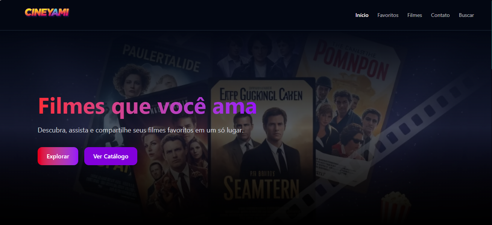

# CineYaMi – Catálogo de Filmes

O projeto **Movie-Catalog** é uma aplicação web desenvolvida com **React, Next.js, TypeScript e Tailwind CSS**, que consome a API pública **OMDb**. Ela permite a busca, visualização e filtragem de filmes, com uma interface responsiva e moderna. A arquitetura segue os princípios do **Atomic Design** e da estrutura por roles/domínios de responsabilidade.



## Tecnologias Utilizadas
- **React & Next.js** – Para renderização de páginas e componentes.
- **TypeScript** – Tipagem estática para maior segurança e produtividade.
- **Tailwind CSS** – Estilização moderna com classes utilitárias.
- **OMDb API** – Fonte de dados para filmes.
- **Atomic Design** – Componentização em átomos, moléculas, organismos, etc.
- **Roles App Architecture** – Estrutura de pastas baseada em responsabilidades (components, contexts, pages, hooks, etc).

## Principais Funcionalidades
- Busca de filmes por nome
- Exibição de detalhes dos filmes
- Filtro por categorias (Ação, Drama, Comédia, etc)
- Layout responsivo para diferentes dispositivos
- Feedback visual de carregamento
- Componentes reutilizáveis organizados com Atomic Design

## Instalação e Execução

### 1. Clone o repositório

```bash
git clone https://github.com/Yasmiinmuniz/Movie-Catalog.git
cd Movie-Catalog
````

### 2. Instale as dependências

```bash
npm install
# ou
yarn
```

### 3. Configure a chave da API OMDb

Crie um arquivo `.env.local` na raiz do projeto com o seguinte conteúdo:

```env
NEXT_PUBLIC_OMDB_API_KEY=your_api_key_here
```

Você pode obter uma chave gratuita em: [https://www.omdbapi.com/apikey.aspx](https://www.omdbapi.com/apikey.aspx)

### 4. Inicie o servidor de desenvolvimento

```bash
npm run dev
# ou
yarn dev
```

Acesse o projeto em `http://localhost:3000`.

## Autora

Desenvolvido por [Yasmin da Silva Muniz](https://www.linkedin.com/in/yasmiinmuniz/)

GitHub: [@Yasmiinmuniz](https://github.com/Yasmiinmuniz)
Instagram: [@yasminnmunizz](https://www.instagram.com/yasminnmunizz/)
